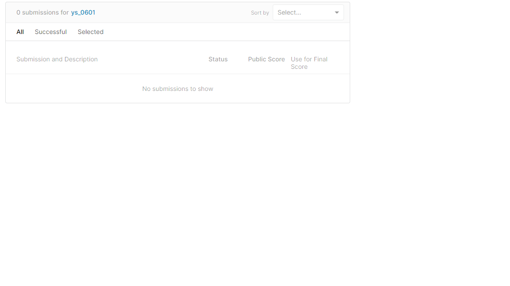
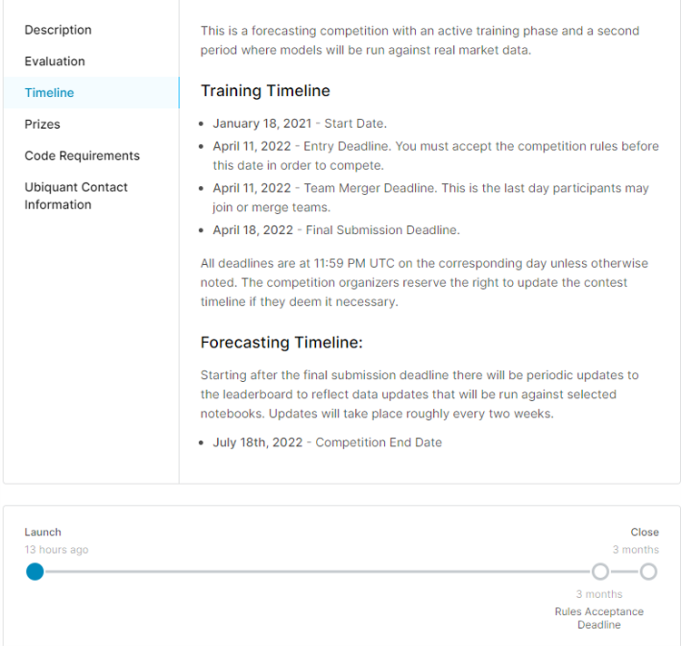
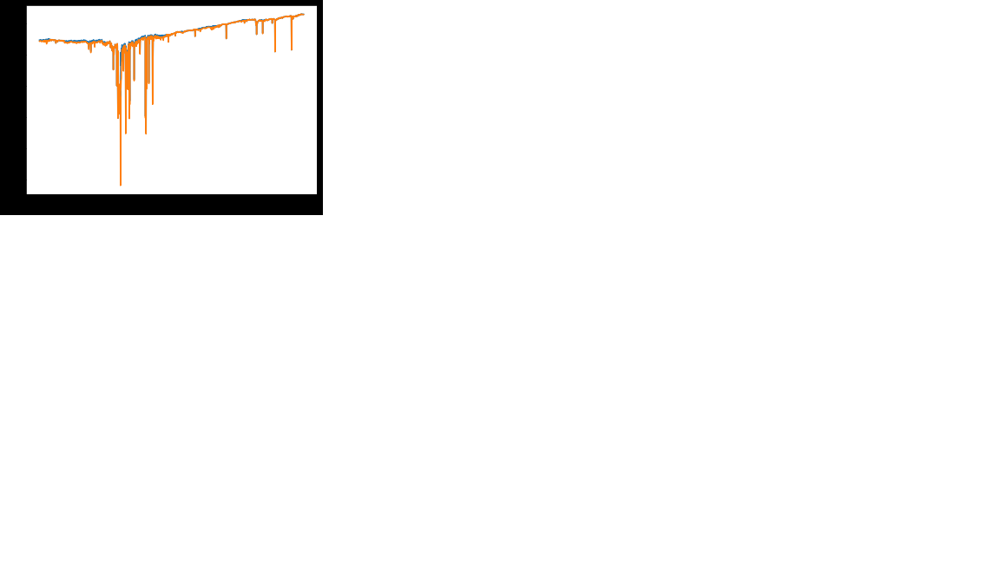
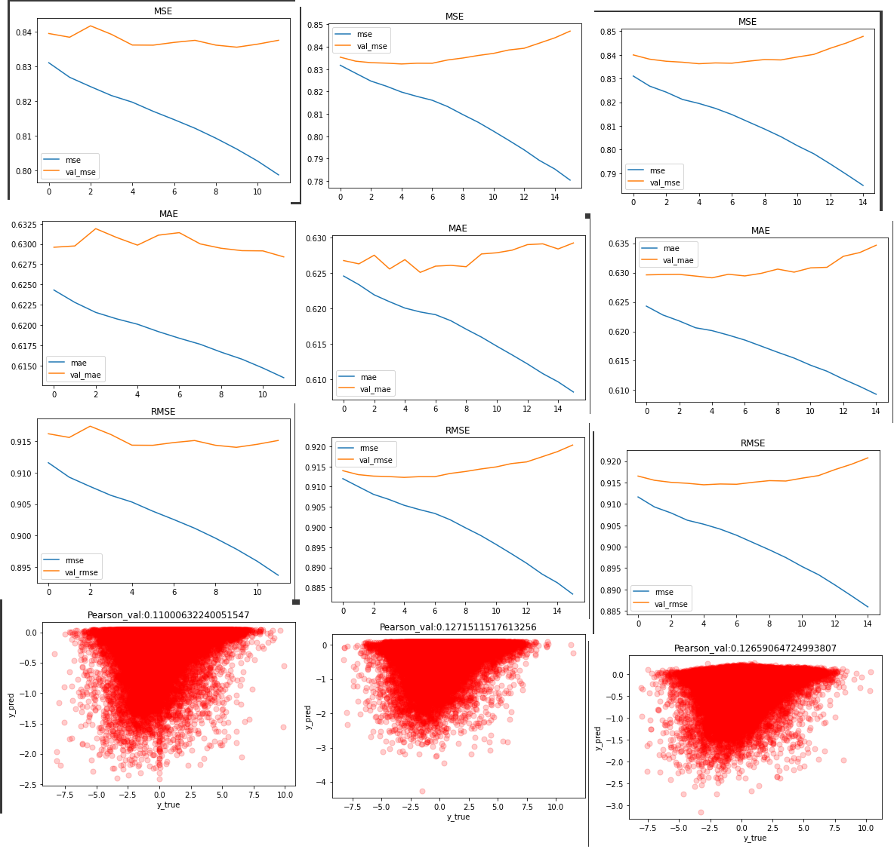

# kaggle_Ubiquant_Market_Prediction
Kaggle-Ubiquant Market Prediction コンペのリポジトリ

- result
  - public: 0.000
  - private: 0.000
  - rank: 0000/9999

    


- directory tree
```
nishika_prediction_of_second-hand_apartment_2022winter
├── README.md
├── data         <---- kaggle提供データ
├── images       <---- readme用画像
├── program      <---- jupyter lab用ノートブック
      ├──std     <---- post時のノートブック
      ├──edit    <---- 作業用ノートブック
```

## Pipeline
- 実行例
  ```bash
  #python3 pipeline.py --globals.balanced=1 --globals.comment=test
  ```

- 結果の表示例
  ```bash
  #python3 show_result.py -d 0
  ```


## Info
- [issue board](https://github.com/ys-0601/kaggle_Ubiquant_Market_Prediction/projects/1)   <---- これ大事だよ
- ref:


## Timeline



## External Dataset
|Name|Detail|Ref|
<<<<<<< HEAD
=======
|ubiquant-parquet|csv⇒parquet変換することで軽量化(18GB>5.5G)。"investiment_id"ごとのfile有。|[url](https://www.kaggle.com/robikscube/ubiquant-parquet)|
|---|---|---|
|---|---|---|
|---|---|---|
|---|---|---|
|---|---|---|
>>>>>>> b474d8f (20220212)
|---|---|---|
|---|---|---|

## Modularized file
|Name|Detail|In|Out|
|---|---|---|---|
|---|---|---|---|

## Features
|Name|structure|type|Detail|
|---|---|---|---|
|---|---|---|---|
|---|---|---|---|
|---|---|---|---|
|---|---|---|---|
|---|---|---|---|


## Paper/Reference
|No.|Status|Name|Detail|Date|Url|
|---|---|---|---|---|---|
<<<<<<< HEAD
|00|<font color='orange'>Todo</font>|Kaggle日記という戦い方|kaggle日記参照元。|2021/06|[url](https://zenn.dev/fkubota/articles/3d8afb0e919b555ef068)|
|01|<font color='gray'>Doint</font>|---|---|---|[url]()|
|02|<font color='gray'>Done</font>|---|---|---|[url]()|
=======
|00|<font color='orange'>Todo</font>Kaggle日記という戦い方|kaggle日記参照元。|2021/06|[url](https://zenn.dev/fkubota/articles/3d8afb0e919b555ef068)|
|01|<font color='gray'>Done</font>|colaboratoryでkaggleをするときに便利なコード|currypanさんcolabのtip集|[url](https://zenn.dev/currypurin/scraps/e01410c6529e8e0d3af9)|
|02|<font color='gray'>Done</font>|doing|Ubiquant Market Prediction - EDA|各データのグラフ化一式|[url](https://www.kaggle.com/gunesevitan/ubiquant-market-prediction-eda)|
>>>>>>> b474d8f (20220212)
|03|<font color='gray'>Doint</font>|---|---|---|[url]()|
|04|<font color='gray'>Done</font>|---|---|---|[url]()|
|05|<font color='gray'>Done</font>|---|---|---|[url]()|
|06|<font color='gray'>Doint</font>|---|---|---|[url]()|
|07|<font color='gray'>Done</font>|---|---|---|[url]()|
|08|<font color='gray'>Done</font>|---|---|---|[url]()|
|09|<font color='gray'>Done</font>|---|---|---|[url]()|
|10|<font color='gray'>Done</font>|---|---|---|[url]()|
|11|<font color='gray'>Done</font>|---|---|---|[url]()|
|12|<font color='gray'>Done</font>|---|---|---|[url]()|
|13|<font color='gray'>Done</font>|---|---|---|[url]()|
|14|<font color='gray'>Done</font>|---|---|---|[url]()|
|15|<font color='gray'>Done</font>|---|---|---|[url]()|

## Memo
- term
  - nb: ノートブック
  - ----


## Basics
**背景と目的**

Ubiquant Market Prediction-ユビキタス・マーケット・プレディクション
将来の市場データに対して予測を行う

投資戦略にかかわらず、金融市場には変動がつきものです。この変動にもかかわらず、プロの投資家は全体的なリターンを推定しようとします。リスクとリターンは投資の種類やその他の要因によって異なり、安定性とボラティリティに影響を及ぼします。リターンの予測を試みるために、金融市場の取引にはコンピュータを使ったアルゴリズムやモデルが多く存在します。しかし、新しい手法やアプローチにより、データサイエンスは定量的研究者の投資リターンの予測能力を向上させることができる。


ユビキント・インベストメント（北京）有限公司は、中国を拠点とする国内有数のクオンツ・ヘッジファンドです。2012年に設立され、数学とコンピュータサイエンスの国際的な才能と最先端技術を駆使して、金融市場のクオンツ投資を推進しています。ユビキタントは、投資家のために長期的に安定したリターンを創出することに取り組んでいます。

このコンペティションでは、投資の収益率を予測するモデルを構築していただきます。過去の価格を用いてアルゴリズムをトレーニングし、テストしてください。優秀な作品は、この実世界のデータサイエンス問題を可能な限り正確に解決します。

成功すれば、定量的研究者のリターン予測能力を向上させることができます。これにより、あらゆる規模の投資家がより良い意思決定を行えるようになります。また、自分が金融データセットに長けていることがわかり、多くの業界で新しいチャンスが広がるかもしれません。


**data(deepL)**   
ファイル内容
このデータセットには、何千もの投資案件の実際の履歴データから得られた特徴が含まれています。あなたの課題は、取引の意思決定に関連する難解な指標の値を予測することです。

これは、時系列APIに依存するコードコンペティションで、モデルが時間を遡ることがないようにするものです。APIを使用するには、評価ページの指示に従います。ノートブックを提出すると、そのノートブックは未知のテストで再実行されます。これは予測コンペティションでもあり、最終的なプライベートリーダーボードはトレーニング期間終了後に収集されたデータを使って決定されるため、パブリックリーダーボードとプライベートリーダーボードの重なりはゼロになります。

ファイル名
train.csv

row_id - その行に一意な識別子。
time_id - データが収集された時刻のIDコード。time IDは順番に並んでいますが、time ID間の実時間は一定ではなく、トレーニングセットよりも最終的なプライベートテストセットの方が短くなる可能性が高いです。
investment_id - 投資のIDコード。すべての投資先がすべての時間IDにデータを持つわけではない。
target - ターゲット。
[f_0:f_299] - マーケットデータから生成された匿名化された特徴量。
example_test.csv - 投入時にAPIがどのような形とフォーマットのデータをあなたのノートブックに配信するかを示すために提供されるランダムなデータです。

example_sample_submission.csv - 一般にアクセス可能な API のコピーが正しいデータの形と形式を提供するように提供される、投稿ファイルの例です。

ubiquant/ - テストセットを提供する画像配信API。テストセットのサンプルをオフラインでエラーなく実行するには、Python 3.7 と Linux 環境が必要な場合があります。

時系列APIの詳細 - このAPIはバッチごとにデータを提供し、バッチごとに1つのtime_idを持つ。

テストセットには約100万行が含まれる予定である。

APIは初期化後、約0.25GBのメモリを必要とする。初期化ステップ(env.iter_test())で必要なメモリは、それよりもかなり多いので、この呼び出しを行うまでモデルをロードしないことをお勧めします。

また、APIの実行時間は、データのロードと配信に15分未満を予定しています。


<<<<<<< HEAD
=======
## データの意味合い
- データ分析の概略
  - row_id ⇒ unique
  - time_id ⇒ 採取時点のID。同一IDは同一タイミングに採取。ID間の間隔は不定。評価時のtest_dataではより間隔が短い可能性。
  - investment_id ⇒ 投資先?ID。同一IDは同一の投資先？
  - [f_0:f_299] ⇒ 各種データ。内容は不明（隠されている）。この部分を主な特徴量とするのだと思う。
>>>>>>> b474d8f (20220212)

### train.csv colomn infomaiton
notebook: eda01.ipynb
example: https://panasonic-cns.udemy.com/course/python-data/learn/lecture/25769636?start=0#content

|name|Explanation|Detail|
|----|----|----|----|
|----|----|----|----|
|----|----|----|----|
|----|----|----|----|


## Log
### 20210119
- join!!
- 参戦の環境構築(git/gitHub)・twitter・Readme・データのダウンロード

<<<<<<< HEAD

=======
### 20210120
- ["Ubiquant-parquet"](https://www.kaggle.com/robikscube/ubiquant-parquet)DataSetをインポート。
  - 明らかに早い。。。
  - 以下のコードでDataFrame形式で読み込める。
    - pd.read_parquet('address')

- <font color='red'>kaggle01</font>
  - Dataset:["Ubiquant-parquet"](https://www.kaggle.com/robikscube/ubiquant-parquet)
  - contents:
  - result:

### 20220122
- 自PC＆kaggle notebookではdfの処理だけで数分かかる。⇒実練習には不足
- google colaboratoryを使用する準備をする。
- kaggle datasets -> google colaboratoryへのダウンロード方法の参照は[こちら](https://rikei-bakadikara2021.com/kaggle-google-colab-tutorial/)
  今回はkaggle notebookで提出しないといけない仕様のよう。
-
- Kaggle Databaseにモデルを複数置いた状態でアンサンブルをするためのコードは[こちら](https://www.kaggle.com/columbia2131/ubiquant-inference-google-colaboratory-training/notebook)
- pkl形式でモデルの保存読み出しは[こちら](https://www.sairablog.com/article/pickle-trained-model-save-read.html)と[こちら](https://dreamer-uma.com/kaggle-api-colab/)
- test_dataの加工どうやるんだろう？？できない？？  ⇒できました。

### 20220124
- colab⇒kaggle datasetに移行したモデルが使えない。下記のエラー発生。model.fitをしてないよ、というエラー。colab側で学習済みのはず。
NotFittedError: Estimator not fitted, call fit before exploiting the model.
  - colabでpklモデルを再展開、model.predictを実施すると実行可。一方kaggle側では同様の処理でエラー。kaggle dataset側でモデルの情報が消されてる？？

### 20220128
- 処理がおかしくなるのは、パッケージのバージョン違いが原因？？
  - colab lightgbm：2.2.3
  - kaggle lightgbm：3.3.1
  - local lightgbm：3.2.1
- パッケージの違いが原因であることが判明。colab側でkaggleと同じバージョンに上げると推論が進んだ。

### 20220129
- ①colab：単純なlightGBM
  ②colabで学習したモデル⇒kaggle Dataset
  ③kaggle notebookで提出
- 一旦subのためのパイプラインが作成できた。
- kaggle APIを使うにあたって、[こちら](https://github.com/Kaggle/kaggle-api)参照。

- nb001
  - ベースラインの単純系
  - model: lightGBM
  - cv_method: rmse
  - cv_value: 0.911406(これはtraining dataに対して)

- kagglenb001
  - from: nb001より参照。
  - ベースラインとしての提出。time_idが無いことが判明。row_idから作れ、ということでしょうか？将来分になるのか、どうか要確認。
  - score: 0.115

- 現状のモデルだと、"investment_id"が効果の大半を担っている。


### 20220130
- [Weird patterns in unique values across time ids](https://www.kaggle.com/lucasmorin/weird-patterns-in-unique-values-across-time-ids)
  
  - blue：plt.plot(np.log(train_data[['time_id','investment_id']].groupby(['time_id']).count()))
    orange：plt.plot(np.log(train_data[['time_id',feature_name]].groupby(['time_id']).nunique()))
  - blue：time_idの個数
  - orange：time_id毎のfeature_nameに関するuniqueな値。
    - blueとorangeが重ならない->feature_nameに関して重複する値が多い。

- [Time Series API Emulator](https://www.kaggle.com/imokuri/time-series-api-emulator)
  - submit時のtime_seriesのエラー対策API？？。提出するときにエラーを分かりやすく吐き出すようにできてる。
  - 取り合えず、kaggle notebookの方に入れておくと便利かも。

- pandas-profilingを全データに対して実行。5 h>で終了せず、中断。プログレスバーが[こちら](https://blog.amedama.jp/entry/2018/07/23/080000)で使えるかな？？

- [Best Loss function that optimize Pearson correlation](https://www.kaggle.com/c/ubiquant-market-prediction/discussion/302181)
  - 評価関数はMSE？RMSE??

- [The mystery on folds](https://www.kaggle.com/c/ubiquant-market-prediction/discussion/302286)
  - LBのデータはtrainデータの直後の可能性が高い
    - ->時系列的に後半のデータをtrainするとLBでは高得点が狙える。
    - PVではshake downする可能性が高い。

- [Perspectives on the comp evaluation metric and (potential) loss functions](https://www.kaggle.com/c/ubiquant-market-prediction/discussion/302874)
  - 損失関数としてピアソンの相関係数とRMSE/MSEを使う場合の違い
    - ピアソンの相関係数：x:yの対応において、一方がシフトしても評価は変わらない。
    - RMSE：一致しない場合、評価が悪化。
      - ->PVとしては予測値がシフトしていることは問題にならない。値同士の間隔が重要。
      - lightGBMで自作の評価関数の作成方法は[こちら](https://tawara.hatenablog.com/entry/2020/05/09/162633)

- [Ubiquant Market Prediction - EDA](https://www.kaggle.com/gunesevitan/ubiquant-market-prediction-eda)
  - 各特徴量のグラフ化一式。分布等確認したい場合はこちら。

- [Custom Pearson Metric for LGBMRegressor](https://www.kaggle.com/c/ubiquant-market-prediction/discussion/302480)
  - lightGBM用ピアソン関数の導入方法。[こちら](https://tawara.hatenablog.com/entry/2020/05/09/162633)の方が詳しい？

- [Unseen test data size](https://www.kaggle.com/c/ubiquant-market-prediction/discussion/301687)
  - データサイズから予想して、検証用time_stampのウィンドウは200くらいか適していそう。

### 20220131
- [Ubiquant Market Prediction with DNN](https://www.kaggle.com/lonnieqin/ubiquant-market-prediction-with-dnn/notebook)の内容理解。
- IntegerLookup layerについて

### 20220205
- [Ubiquant Market Prediction with DNN](https://www.kaggle.com/lonnieqin/ubiquant-market-prediction-with-dnn/notebook)を一通り理解。
- kaggleDatasetによるモデルの受け渡しで苦戦中。h5ファイル形式はサポートせず？？？？
- dataset側でディレクトリ毎アップデートすることで解決。
- kagglenotebookのsubがエラーになる。
  - 考えられる原因：tensorflowのバージョンアップを実施してる->pip install   internetNGのため、ここがエラー？？

- nb003
  - ベースラインの単純系
  - model: DNN
  - cv_method: pearson_score
  - cv_value: 0.1119

- kagglenb003
  - from: nb003より参照。
  - テスト用に提出。epoch数を制限してsub。5fold/2poch。scoreが異常に高いのが気になる。
  - score: 0.142

### 20220207
- nb004
  - ベースラインの単純系
  - model: DNN
  - cv_method: pearson_score
  - cv_value: 0.12000

- kagglenb004
  - from: nb004より参照。
  - DNNベースラインとしてsub。5fold/30epochs。かなり良い値
  - score: 0.148

- 全体的に過学習＆CVが改善してない。また、y_predがマイナスになってしまっている。

>>>>>>> b474d8f (20220212)
